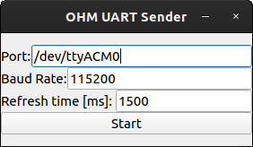
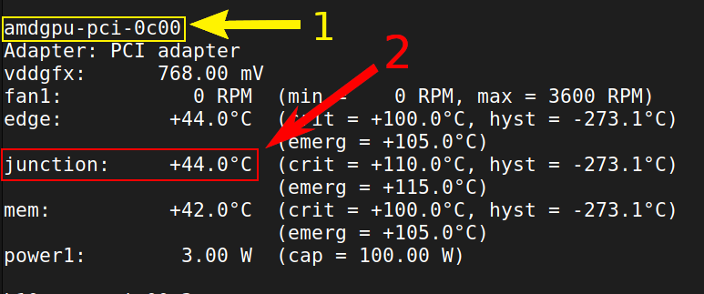
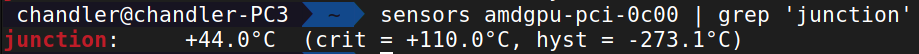

# OHM UART Sender - Linux
Send your PC Information through a Serial Port to send to a smart device like a Microcontroller like Arduino or a Computer like a Raspberry Pi using a minimal GUI made in [PyQt5](https://pypi.org/project/PyQt5/):

<p align="center">
  
</p>

## Installation
It is based on a search in terminal trough 'sensors' Application, to check if sensors is installed in your Linux distro type:
```
sensors --version
```
if is not installed, you can follow these steps:
### Ubuntu/Debian based distros
Install with:
```
apt install lm-sensors
```

### Fedora based distros
[NOT TESTED]

Install with:
```
dnf install lm_sensors
```
### Arch based distros
[NOT TESTED]

Install [this AUR package](https://aur.archlinux.org/packages/lm_sensors-git).

### Checking your Hardware
With `lm_sensors`, check your hardware info with `sudo sensors-detect`.
then run sensors and check which information do you want to send by UART by running `sensors`:
<p align="center">
  
</p>

Test your hardware information by running:
```
sensors <your device name> | grep <what information you want>
```
for example:
```
sensors amdgpu-pci-0c00 | grep 'junction'
```
will result:
<p align="center">
  
</p>

Download this repository and edit the `runningThread/__init__.py` file in `temp_schedule` method with the correct command for your user case.

### Installing Python and Necessary Modules
Then install [Python](https://www.python.org/) with these packages:
- [PyQt5](https://pypi.org/project/PyQt5/); and
- [PySerial](https://pypi.org/project/pyserial/).

With pip, you can install those packages by typing:
```
pip install PyQt5 pyserial
```
### Running Application
Run this application with this repository as the current working directory and run:
```
python script.py
```